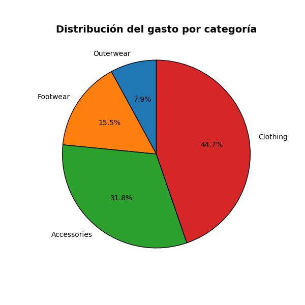

# Visualización de datos - PEC 2
## Visualización 1 - Pie Chart

El conjunto de datos sobre el cual se trabaja contiene información sobre los comportamientos de compra. En estos datos podemos encontrar el detalle de los compradores como edad y género, el tipo de compras realizadas o en la época que las realizaron, entre otros atributos.

Para la realización del Pie Chart se ha optado por analizar el gasto en USD por tipo de producto. De esta forma podemos ver a grandes rasgos cual es el sector en el que la población invierte más.

Con este gráfico estamos ofreciendo de manera casi instantánea un foto general de cual es el sector que más dinero produce. La persona indicada podría con este gráfico, y en apenas unos segundo, evaluar o tomar decisiones sobre la dirección de la compañía. Habiendo adquirido un conocimiento sobre que el mercado de la ropa y los accesorios es el más explotable.

Nombre del dataset: Shopping behaviours dataset
Autor: Zubaira Maimona
Año: 2025
Licencia: CC0: Public Domain
Enlace: https://www.kaggle.com/datasets/zubairamuti/shopping-behaviours-dataset/data